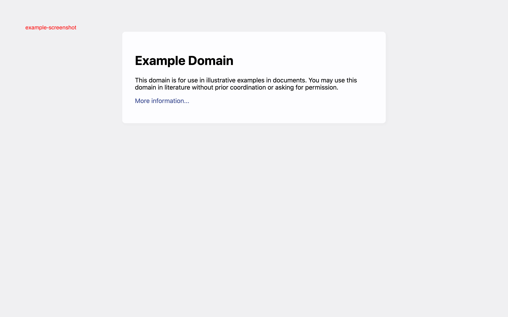

# Screenshotter

Simple tool that captures a screenshot of a desired URL via a commandline. Useful for visual regression or showcasing a change in flow.

Note this was built as a single use and therefore specific use tool. It will be refactored for more general purposes if used again, however the structure and automation exists.



## Requires

- node - use [nvm](https://github.com/nvm-sh/nvm) or [asdf-vm](https://github.com/asdf-vm/asdf)
- bash

## Running

```sh
# Set node runtime
nvm use

# Install required dependencies
npm install

# Run the script
npm start
```

## Todo/Ideas

- [ ] Standalone application
- [ ] Read from a csv
- [ ] Use a single language
